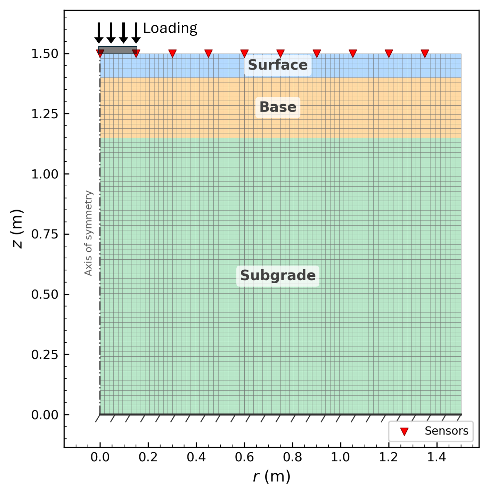
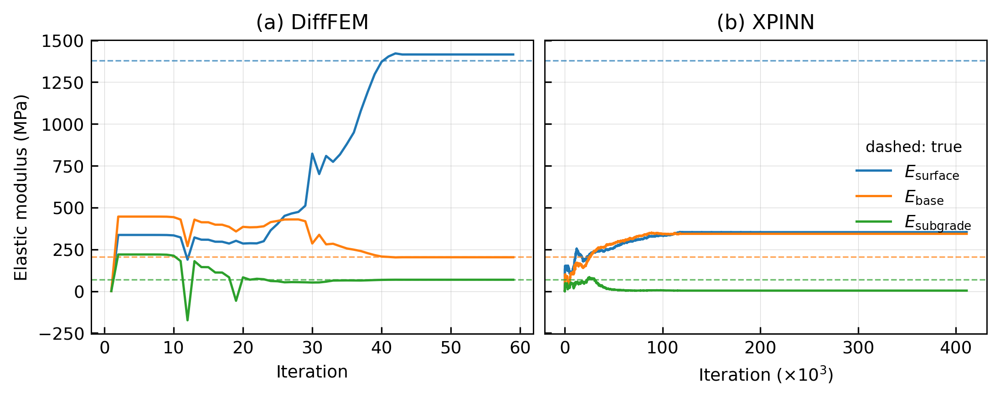
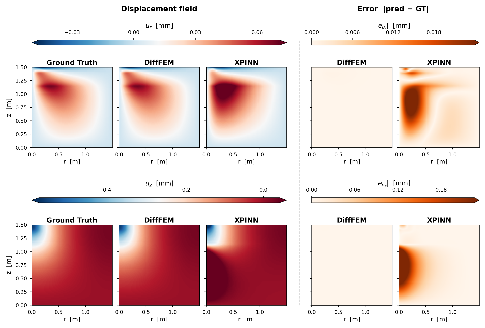

# Differentiable FEM vs. PINNs for inverse problems

This code shows how a differentiable solver (FEM) can solve inverse problems better than PINN-based approaches in backcalculating the elastic moduli of multi-layered systems.

It accompanies the paper

> Y. Choi, H. Moon, and S. Ryu. Critical evaluation of PINN for FWD inverse analysis and differentiable FEM as an alternative. (under review)

## Problem setup



Axisymmetric three-layer pavement under a surface load. The layer moduli are recovered from the deflections at ten surface sensors.

## Results with noisy sensor data (noise std. 1 μm)



DiffFEM converges close to the true moduli (dashed) in fewer than 60 iterations. XPINN remains far from them after 4×10⁵ iterations.



The displacement field of DiffFEM matches the ground truth (GT), whereas that of XPINN deviates from it.

## Installation (Linux, Python 3.10)

```bash
python3.10 -m venv .venv
source .venv/bin/activate
pip install -r requirements.txt
```

`torch==2.12.0` from PyPI installs the CUDA 13 libraries on Linux.
For another CUDA version or a CPU-only setup, install PyTorch 2.12.0 first by following https://pytorch.org/get-started/locally/.

## Usage

Run from the repository root. Results are written to `Results/` and figures to `figures/`.

```bash
python forward_fem.py                                    # FE model and noise-free data (optional, included in Dataset/)
python synthetic_noise.py                                # noisy data, 1-5 μm (optional, included in Dataset/)
python inverse_difffem.py                                # DiffFEM, all noise levels
python inverse_xpinn.py --config configs/xpinn_noise_1.json   # XPINN, one noise level (xpinn_noise_0-5)
python inverse_vanilla_pinn.py --noise_std 0             # vanilla PINN
python sweep_inverse_pinn.py configs/sweep_network.json  # XPINN hyperparameter sweeps (requires ray[tune]==2.59.0)

python visualizers/plot_modulus_history.py --noise_std 1          # needs the DiffFEM and XPINN runs
python visualizers/plot_displacement_comparison.py --noise_std 1  # needs the DiffFEM run
```

`pretrained/` contains the trained XPINN (noise levels 0-5 μm) and vanilla PINN weights.
`plot_displacement_comparison.py` uses them when `Results/noise_{k}/` has no trained model.
Iteration counts can differ slightly across hardware and PyTorch versions.

## Citation

If you use this code, please cite the paper above. The full reference will be added after publication.

## License

MIT License. See `LICENSE`.
